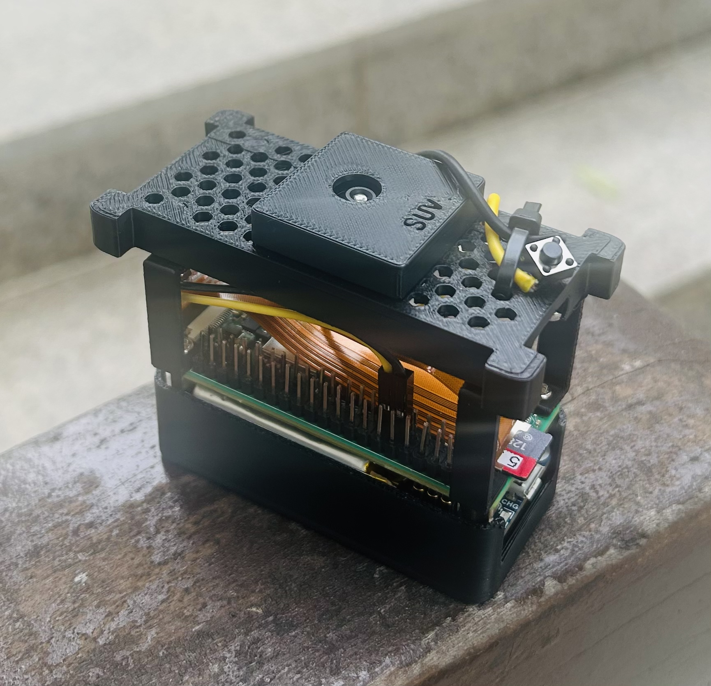

# tiny-film



My own digital film camera.

Code and original CAD in this repo are [MIT](LICENSE). Third-party Printables
case STLs keep their upstream Creative Commons licenses — see
[assets/README.md](assets/README.md).

## Phone web app

Run the local capture browser from the project root:

```bash
python3 src/tiny-film-cam/web.py
```

Then open `http://<pi-ip>:8000` from a phone on the same Wi-Fi network.
Tap **Take Photo** to capture from the phone.

## Boot services

Install the web app, physical shutter, and battery monitor services on the
Raspberry Pi:

```bash
./scripts/install_service.sh --enable-now
```

After pulling new changes, restart the services:

```bash
git pull
sudo systemctl restart tiny-film-web.service tiny-film-shutter.service tiny-film-battery.service
```

Check service status:

```bash
sudo systemctl status tiny-film-web.service tiny-film-shutter.service tiny-film-battery.service --no-pager
```

Follow live service logs:

```bash
sudo journalctl -u tiny-film-web.service -u tiny-film-shutter.service -u tiny-film-battery.service -f
```

The web service starts the phone app on port `8000`. The phone app and shutter
service both save captures to `data/captures/`. The shutter service listens for
a simple physical button on BCM GPIO 17 by default. Wire the button between BCM
GPIO 17, physical pin 11, and any GND pin.

The battery service polls the Waveshare UPS HAT (C) over I2C at address `0x43`
and writes `data/battery.json`. The web app exposes the latest reading at
`GET /api/battery`, including percent remaining, voltage, current, power, and
charging state. The percent is a voltage-derived estimate, so it can read high
while the HAT is plugged into USB power.

To change the button pin or capture settings, copy `.env.example` to `.env` and
edit the `TINY_FILM_*` values.

For a more film-friendly source capture, start by testing:

```bash
python3 src/tiny-film-cam/capture.py \
  --sharpness 0.3 \
  --contrast 0.85 \
  --saturation 0.9 \
  --ev -0.7 \
  --awb-mode daylight \
  --rotation 270
```

For highlight safety, capture a bracket from one warmed-up camera session:

```bash
python3 src/tiny-film-cam/capture.py \
  --exposure-brackets 0,-0.7,-1.0 \
  --awb-lock
```
