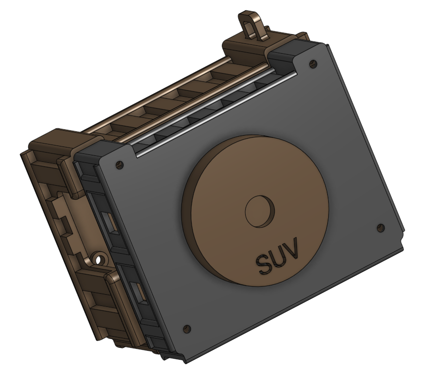

# Tiny Film Camera

An open-source digital camera built around the Raspberry Pi Zero 2 W and Camera
Module 3. Tiny Film pairs a physical shutter with film-inspired JPEG looks and a
phone-friendly local gallery—without sending your photos to the cloud.

<p align="center">
  
</p>

## What it does

- Tap the physical shutter for a photo; hold it for a short video.
- Choose Black & white, Current, or Cold with a three-position hardware switch.
- Capture, browse, download, and delete photos from a phone on the same Wi-Fi.
- Monitor the Waveshare UPS battery from the web interface.
- Apply configurable exposure, white-balance, focus, rotation, and JPEG settings.
- Start the web app and hardware daemons automatically with systemd.

## Hardware

- Raspberry Pi Zero 2 W
- Raspberry Pi Camera Module 3
- Waveshare UPS HAT (C)
- Momentary shutter button
- Optional passive buzzer and SS23D32 three-position switch
- 3D-printed enclosure from [`assets/`](assets/README.md)

See the complete [bill of materials](docs/bom.md) and [setup guide](docs/setup.md).

## Quick start

On a Raspberry Pi running Raspberry Pi OS:

```bash
git clone https://github.com/SuveenE/tiny-film-camera.git
cd tiny-film-camera

sudo apt update
sudo apt install -y \
  python3-picamera2 python3-pil python3-gpiozero python3-smbus \
  i2c-tools ffmpeg

cp .env.example .env
./scripts/install_service.sh --enable-now
```

Open `http://<pi-ip>:8000` from a phone on the same Wi-Fi network. Captures are
saved under `data/captures/`.

> [!WARNING]
> The web interface has no authentication. Use it only on a trusted local
> network and do not expose port `8000` to the internet.

## Use it

Take a photo or record a ten-second video from the command line:

```bash
python3 src/tiny-film-cam/capture.py
python3 src/tiny-film-cam/record.py --duration 10
```

Customize the camera, GPIO pins, filters, battery calibration, and service
settings in [`.env.example`](.env.example), then copy the values you need into
your local `.env`.

## Build guides

- [Camera and Raspberry Pi setup](docs/setup.md)
- [Physical shutter](docs/shutter-button.md)
- [Passive buzzer](docs/buzzer.md)
- [Photo-filter switch](docs/filter-switch.md)
- [Commands and service management](docs/commands.md)
- [Troubleshooting](docs/debug.md)
- [Enclosure and printable assets](assets/README.md)

## License

Code and original CAD are available under the [MIT License](LICENSE).
Third-party enclosure models retain their upstream Creative Commons licenses;
see [`assets/README.md`](assets/README.md) for attribution.
