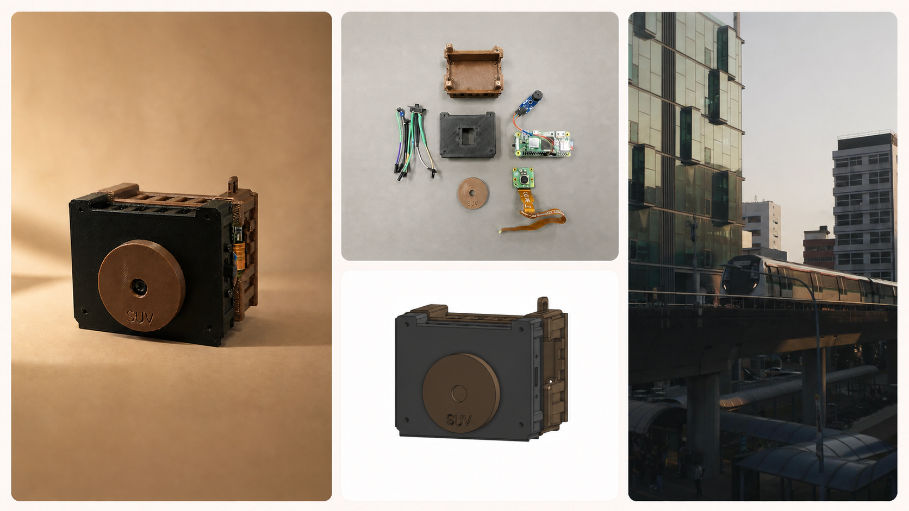
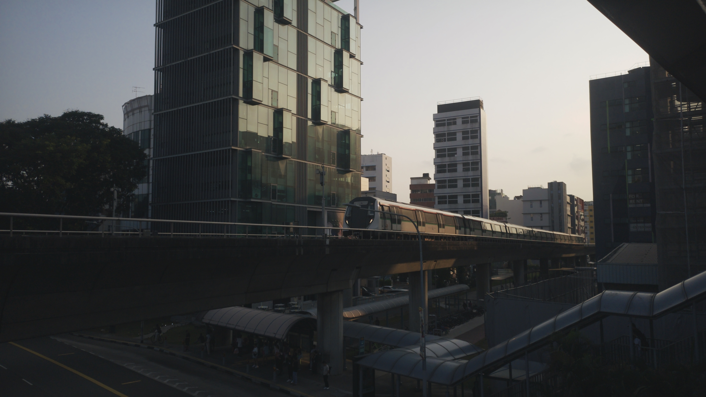
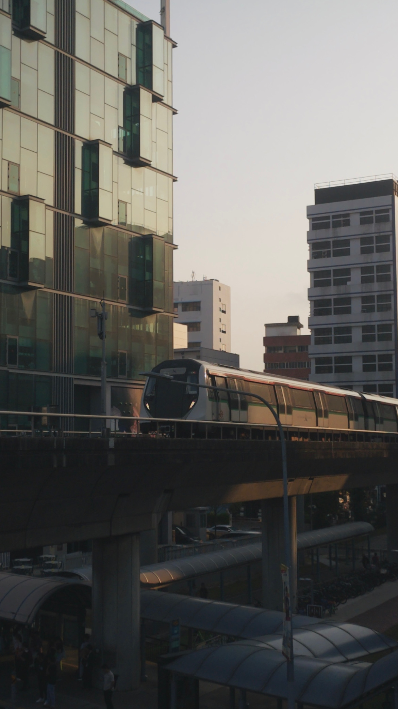

# Tiny Film Camera

Tiny Film Camera is an open-source digital camera built around the Raspberry Pi
Zero 2 W and Camera Module 3. It can capture photos and record short video clips
using dedicated photo and video buttons, with three selectable looks (warm, cold,
and black & white) controlled by a physical slider switch. A buzzer provides
feedback for startup and photo capture, and a local photo gallery can be accessed
directly from your phone.

<p align="center">
  
</p>
<p align="center">
  <sub>
    <a href="assets/v1/product-images/camera-launch-warm.png">Assembled camera</a> ·
    <a href="assets/guides/components.png">Components</a> ·
    <a href="assets/v1/v1-design.png">v1 CAD design</a> ·
    <a href="assets/photo-samples/train-zoomed-1170x2080.jpg">Photo sample</a>
  </sub>
</p>

## Sample photos

An original photo and a zoomed-in view captured with Tiny Film Camera. Click
either image to view it at full resolution.

<table>
  <tr>
    <td align="center" width="68%">
      <a href="assets/photo-samples/train-original-4608x2592.jpg">
        
      </a>
    </td>
    <td align="center" width="32%">
      <a href="assets/photo-samples/train-zoomed-1170x2080.jpg">
        
      </a>
    </td>
  </tr>
  <tr>
    <td align="center"><strong>Original</strong><br /><sub>4608 × 2592 pixels</sub></td>
    <td align="center"><strong>Zoomed in</strong><br /><sub>1170 × 2080 pixels</sub></td>
  </tr>
</table>

## What it does

- Use dedicated physical buttons for photos and short video clips.
- Choose Warm, Cold, or Black & white with a three-position hardware switch.
- Capture, browse, download, and delete photos from a phone on the same Wi-Fi.
- Monitor the Waveshare UPS battery from the web interface.
- Apply configurable exposure, white-balance, focus, rotation, and JPEG settings.
- Start the web app and hardware daemons automatically with systemd.

## Hardware

- Raspberry Pi Zero 2 W
- Raspberry Pi Camera Module 3
- Waveshare UPS HAT (C)
- Two momentary buttons (photo and video)
- Optional passive buzzer and SS23D32 three-position switch
- 3D-printed enclosure from [`assets/`](assets/README.md)

See the complete [bill of materials](docs/bom.md) and [setup guide](docs/setup.md).

## Quick start

On a Raspberry Pi running Raspberry Pi OS:

```bash
git clone https://github.com/SuveenE/tiny-film-camera.git
cd tiny-film-camera

sudo apt update
sudo apt install -y \
  python3-picamera2 python3-pil python3-gpiozero python3-smbus \
  i2c-tools ffmpeg

cp .env.example .env
./scripts/install_service.sh --enable-now
```

Open `http://<pi-ip>:8000` from a phone on the same Wi-Fi network. Captures are
saved under `data/captures/`.

> [!WARNING]
> The web interface has no authentication. Use it only on a trusted local
> network and do not expose port `8000` to the internet.

## Use it

Take a photo or record a ten-second video from the command line:

```bash
python3 src/tiny-film-cam/capture.py
python3 src/tiny-film-cam/record.py --duration 10
```

Customize the camera, GPIO pins, filters, battery calibration, and service
settings in [`.env.example`](.env.example), then copy the values you need into
your local `.env`.

## Build guides

- [Button, slider, and buzzer wiring](docs/wiring.md)
- [Camera and Raspberry Pi setup](docs/setup.md)
- [Physical shutter](docs/shutter-button.md)
- [Passive buzzer](docs/buzzer.md)
- [Photo-filter switch](docs/filter-switch.md)
- [Commands and service management](docs/commands.md)
- [Troubleshooting](docs/debug.md)
- [Enclosure and printable assets](assets/README.md)

## License

Code and original CAD are available under the [MIT License](LICENSE).
Third-party enclosure models retain their upstream Creative Commons licenses;
see [`assets/README.md`](assets/README.md) for attribution.
